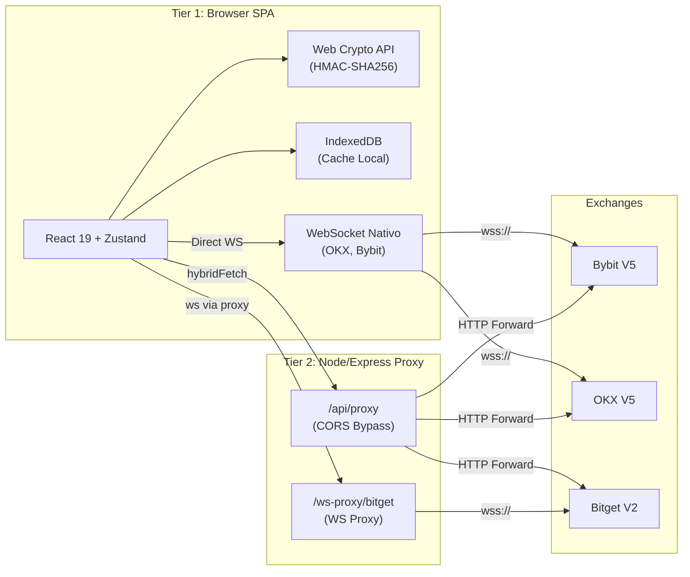
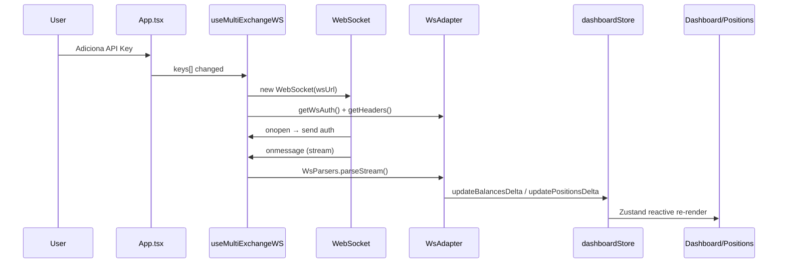

# Deep Dive Arquitetural — Estado Atual do Projeto

## 1. Visão Geral

O **Crypto Portfolio Manager** é uma SPA React/TypeScript que consolida em tempo real saldos, posições e histórico de três exchanges de criptomoedas (**Bybit**, **OKX**, **Bitget**) sob uma interface unificada. Opera sob princípio **Zero-Trust**: nenhuma chave de API trafega por servidores terceiros.

---

## 2. Arquitetura de Runtime (2-Tier Local)

| Camada | Responsabilidade |
|--------|-----------------|
| **Browser (Tier 1)** | UI, WebSocket direto (OKX/Bybit), criptografia (`window.crypto.subtle`), estado (Zustand), cache (IndexedDB). Chaves API vivem exclusivamente em `localStorage`. |
| **Express Proxy (Tier 2)** | Bypass CORS para REST APIs. Proxy WebSocket exclusivo para Bitget. **Totalmente agnóstico** a secrets — recebe headers pré-assinados e repassa. Possui allowlist de domínios (`api.bybit.com`, `api.bitget.com`, `www.okx.com`, `api.okx.com`). |

---

## 3. Stack Tecnológica

| Domínio | Tecnologia |
|---------|------------|
| Frontend | React 19, TypeScript, Vite 6.2, Tailwind CSS v4 |
| Estado | Zustand 5 (3 micro-stores: `apiKeysStore`, `dashboardStore`, `settingsStore`) |
| Criptografia | Web Crypto API nativa (`hmacSha256` em `/src/utils/cryptoLib.ts`) |
| Gráficos | Recharts 3.8 |
| Exportação | jsPDF + jspdf-autotable (PDF), xlsx (Excel), CSV nativo |
| Cache | `idb` 8.0 (IndexedDB wrapper) |
| Proxy | Express 4 + `http-proxy-middleware` |
| Math | `big.js` 7.0, `date-fns` 4.1 |
| Testes | Vitest 4.1 |

---

## 4. Tipos Unificados (Contratos da Camada de Normalização)

Definidos em `/src/types.ts`:

| Interface | Finalidade |
|-----------|-----------|
| `UnifiedPosition` | Posição aberta em tempo real (18 campos: size, entryPrice, markPrice, unrealizedPnl, leverage, liquidationPrice, roe, tp, sl, etc.) |
| `UnifiedHistoryPosition` | Posição encerrada do histórico (realizedPnl, closeTime, entryPrice, closePrice, fundingFee, tradingFee) |
| `UnifiedOrder` | Ordens em aberto e históricas unificadas (side, price, qty, filledQty, status, average price, fees, trigger price) |
| `UnifiedBillRecord` | Depósito/Saque (type: deposit/withdrawal/funding/fee/transfer/other, amount, ccy, timestamp) |
| `SymbolPnLRecord` | Agregação PnL por símbolo com `Big.js` (totalPnL, longPnL, shortPnL) |

---

## 5. Adapter Layer (Strategy Pattern)

Todos os adapters estão consolidados em classes dedicadas no diretório `/src/services/adapters/` e implementam a interface `IExchangeAdapter`. O contrato unificado engloba os seguintes métodos de sincronização:

- `fetchAndNormalize(key, start?, end?)` → `Promise<UnifiedHistoryPosition[]>` (Histórico de posições encerradas)
- `fetchBills?(key, start?, end?)` → `Promise<UnifiedBillRecord[]>` (Histórico de depósitos e saques)
- `getOpenOrders?(key)` → `Promise<UnifiedOrder[]>` (Ordens em aberto)
- `getHistoryOrders?(key, start?, end?)` → `Promise<UnifiedOrder[]>` (Histórico de ordens fechadas ou canceladas)
- `fetchInstrumentMetadata?(symbol)` → `Promise<UnifiedAssetCategory | 'NOT_FOUND'>` (Metadados públicos para classificação de ativos)

Para viabilizar a inicialização paralela rápida via REST, cada classe implementa também:
- `getBalance(key)` → `Promise<UnifiedBalance[]>` (Saldos de Spot e Derivativos)
- `getOpenPositions(key)` → `Promise<UnifiedPosition[]>` (Posições ativas em tempo real)

### Adapters por Exchange

| Exchange | Arquivo de Classe | Observações |
|----------|-------------------|-------------|
| **Bybit** | `BybitAdapter.ts` | Time-sync automático dedicado. Suporta categorização paralela linear e inversa (UTA e Inverse). |
| **OKX** | `OkxAdapter.ts` | Suporta tipos de instrumentos SWAP, FUTURES e MARGIN. WebSocket direto e consultas REST paginadas retroativas. |
| **Bitget** | `BitgetAdapter.ts` | Suporta USDT-FUTURES, COIN-FUTURES e USDC-FUTURES. WS direcionado via proxy devido a bloqueios nativos do browser. |

Cada adapter expõe também métodos estáticos para assinatura criptográfica de headers (`getHeaders()`) e autenticação de WebSocket (`getWsAuth()`). Os parsers WebSocket em `src/hooks/useMultiExchangeWS.ts` utilizam as regras de mapeamento idênticas para reatividade contínua. Os adapters também processam streams delta e os injetam diretamente no `dashboardStore` via `getState()`.

---

## 6. Orquestradores (Factory Services)

| Serviço | Arquivo | Papel |
|---------|---------|-------|
| **PositionHistoryService** | `/src/services/positions/PositionHistoryService.ts` | Factory → Adapter. Dois modos: `fetchExchangeHistory` (direto) e `fetchWithCache` (incremental com IndexedDB). |
| **OrderHistoryService** | `/src/services/orders/OrderHistoryService.ts` | Factory → Adapter. Dois modos: carrega do cache local e faz fetch incremental de ordens fechadas/canceladas com IndexedDB. |
| **BillsHistoryService** | `/src/services/bills/BillsHistoryService.ts` | Factory → Adapter. Modo direto (sem cache IndexedDB por enquanto). |

---

## 7. Camada de Persistência Local (IndexedDB)

`/src/services/historyCache.ts` — DB `crypto-dashboard-cache` com os seguintes object stores:

| Store | Key | Índices | Uso |
|-------|-----|---------|-----|
| `positionHistory` | `id` (UnifiedHistoryPosition.id) | `by-connectionId`, `by-closeTime` | Cache incremental de trades encerrados |
| `orderHistory` | `id` (UnifiedOrder.id) | `by-connectionId` | Cache incremental de ordens históricas/fechadas |
| `orderCacheMeta` | `connectionId` | — | Rastreia `lastFetchTimestamp` para fetches incrementais de ordens fechadas |

**Fluxo Incremental (SWR - Stale-While-Revalidate)**:
1. React Hook (`usePositionHistory`, `useOrderReports`) carrega os dados estáticos do cache via SWR e renderiza a tela instantaneamente.
2. Hook dispara fetch em background para as exchanges a partir do `lastFetchTimestamp`.
3. Novos deltas recebidos atualizam o banco IndexedDB e disparam re-render automático para a UI.

---

## 8. Hooks React (Camada de Integração)

| Hook | Arquivo | Responsabilidade |
|------|---------|-----------------|
| `useMultiExchangeWS` | `/src/hooks/useMultiExchangeWS.ts` | Gerencia ciclo de vida completo dos WebSockets. Exponential backoff (cap 60s). Ping/Pong a cada 20s. Short-Polling REST universal (todas exchanges) configurável. Mock data injection. |
| `usePositionHistory` | `/src/hooks/usePositionHistory.ts` | Padrão SWR. Carrega rápido via IndexedDB, faz fetch incremental com `PositionHistoryService` em background. Filtra por período in-memory. |
| `useOrderReports` | `/src/hooks/useOrderReports.ts` | Padrão SWR para ordens fechadas. Usa o `OrderHistoryService` para recuperar os dados e atualizar de modo reativo. |
| `useBillsHistory` | `/src/hooks/useBillsHistory.ts` | Orquestra `BillsHistoryService.fetchBills()` em paralelo. Live + Mock mode (Sem cache IndexedDB, consulta viva). |
| `useHistoryCachePolling` | `/src/hooks/useHistoryCachePolling.ts` | Background polling configurável (default 15 min) para manter cache IndexedDB de posições e de ordens atualizado em segundo plano. |
| `usePnLBySymbol` | `/src/hooks/usePnLBySymbol.ts` | Agregação PnL por símbolo usando `Big.js`. |

---

## 9. Zustand Stores (Estado Global)

| Store | Persistência | Campos-chave | Papel |
|-------|-------------|--------------|-------|
| `apiKeysStore` | `localStorage` (`crypto-dashboard-api-keys-v2`) | `keys[]` (id, label, exchange, apiKey, apiSecret, passphrase, isActive) | CRUD de chaves de API locais em formato Zero-Trust. `/src/store/apiKeysStore.ts` |
| `dashboardStore` | **Memória** (volátil) | `statuses{}`, `errors{}`, `balances{}`, `positions{}`, `telemetry{}` | Estado principal do WebSocket real-time, incluindo o histórico de latência e throughput. `/src/store/dashboardStore.ts` |
| `settingsStore` | `localStorage` (`terminal-settings`) | `useMockData`, `pollingInterval` (default 5s), `historyCacheInterval` (default 15min), `lastSyncTime` | Configurações globais e estado unificado de tempo de sincronização para travar timers. `/src/store/settingsStore.ts` |
| `logStore` | **Memória** (volátil) | `logs[]` (id, timestamp, level, source, message) | Armazena um buffer de logs (FIFO de 1000 itens) capturados pelo interceptor global de console. `/src/store/logStore.ts` |

---

## 10. Componentes React (UI)

### Páginas Principais
| Componente | Rota/Tab | Descrição |
|------------|----------|-----------|
| `Dashboard.tsx` | `dashboard` | Painel principal estruturado em Masonry: balanços, Donut de alocação de risco por exchange, Treemap de ativos cross-exchange e o painel de **Capital Protection & Hedge**. `/src/components/Dashboard.tsx` |
| `Positions.tsx` | `positions` | Abas unificadas de posições em aberto (**Open Positions**) e histórico de trade encerrados (**Positions History**). (Note: `/src/components/OpenPositions.tsx` e `/src/components/ClosedPositions.tsx`). |
| `OpenPositions.tsx` | — | Grid de tempo real em modo Detailed ou Lite. Monitoramento de ROE %, PnL não realizado, Margem, Stop Loss/Take Profit, preço de liquidação e classificação visual do ativo. `/src/components/OpenPositions.tsx` |
| `ClosedPositions.tsx` | — | Visão histórica com filtros de SWR por IndexedDB, exibindo métricas robustas (Win Rate, Profit Factor, Médias de W/L e maior Trade). `/src/components/ClosedPositions.tsx` |
| `AnalyticsDashboard.tsx` | `analytics` | Painel avançado contendo Win Rate Geral, Profit Factor real, Sazonalidade (dia e bloco de 4 horas), Capital Flow (depósitos e saques) e Milestone Matrix. `/src/components/analytics/AnalyticsDashboard.tsx` |
| `PnLBySymbol.tsx` | `analytics-pnl-symbol` | Agrega e distribui lucros e prejuízos por criptoativos, com filtros precisos por categorias de contratos margined (USDT-M, Coin-Margined, USDC-M, Linear/Inverse). `/src/components/analytics/PnLBySymbol.tsx` |
| `OrderReports` | `orders` | Nova seção de relatórios de ordens (**Open Orders** e **Order History**) dividida por corretora com ordenação, buscas regex locais e linhas expansíveis para expor IDs brutos e taxas operacionais. `/src/components/analytics/OrderReports/` |
| `ReportsDashboard.tsx` | `reports` | Geração instantânea e download de relatórios operacionais em PDF (jspdf), Excel (xlsx) e CSV nativo. `/src/components/analytics/ReportsDashboard.tsx` |
| `ApiKeys.tsx` | `api-keys` | Tabela acordeão agrupando conexões ativas por corretora com telemetria visualizada em tempo real (latência sparklines e throughput em KB/s). Integra o `ConnectionLogTerminal`. `/src/components/ApiKeys.tsx` |
| `Settings.tsx` | `settings` | Configurações de intervalos de polling, gerenciamento de limpeza do cache de IndexedDB e o interruptor do **Simulation/Mock Mode**. `/src/components/Settings.tsx` |
| `ApiTester.tsx` | `api-tester` | **Dev Tools** — Ferramenta integrada de conectividade REST e WS bruta. `/src/components/ApiTester.tsx` |

### Componentes Auxiliares
| Componente | Responsabilidade |
|------------|-----------------|
| `ConnectionLogTerminal.tsx` | Terminal docked acoplado nas credenciais com drag-to-resize, busca local, logs mascarados sem secrets, filtros semânticos (INFO, SYSTEM, DATA, WARN, ERROR). `/src/components/ConnectionLogTerminal.tsx` |
| `Sidebar.tsx` | Navegação colapsável com badge de posições abertas e o botão de **Privacy Mode (Ocultamento Global)**. `/src/components/Sidebar.tsx` |
| `StatusBar.tsx` | Barra inferior contendo status e monitor de latência consolidada. `/src/components/StatusBar.tsx` |
| `PositionsTicker.tsx` | Marquee ticker em tempo real no topo refletindo variação real-time de preços das posições abertas. `/src/components/PositionsTicker.tsx` |
| `WorkSpace.tsx` | Container wrapper simples. `/src/components/WorkSpace.tsx` |

---

## 11. Utilitários Puros

| Arquivo | Papel | LOC |
|---------|-------|-----|
| `cryptoLib.ts` | `hmacSha256()` via Web Crypto API (hex/base64) | `/src/utils/cryptoLib.ts` |
| `math-crypto.ts` | `calculateRoe()` | `/src/utils/math-crypto.ts` |
| `analyticsMath.ts` | Win Rate, Profit Factor, Funding Efficiency, Daily ROI, Seasonality | `/src/utils/analyticsMath.ts` |
| `milestoneMath.ts` | Milestone Price Matrix (⚠️ atualmente simulado) | `/src/utils/milestoneMath.ts` |
| `exportUtils.ts` | Exportação PDF/CSV/Excel | `/src/utils/exportUtils.ts` |
| `formatters.ts` | Formatação de moedas (USD/BRL) | `/src/utils/formatters.ts` |
| `proxyFetch.ts` | `proxyFetch()` + `hybridFetch()` (Direct → Proxy fallback) | `/src/utils/proxyFetch.ts` |

---

## 12. Mock Data & Testes

### Mocks
Em [src/mock/](file:///x:/Dev/git/CriptoDashboard/crypto-dashboard/src/mock/):
- `accounts.json` (1.2KB) — 3 contas mockadas
- `balances.json` (18KB) — ~50 balances
- `positions.json` (308KB) — ~150 posições
- `history.json` (251KB) — ~500 trades históricos
- `bills.json` (17KB) — ~50 depósitos/saques
- `generateMocks.js` (6KB) — Script gerador

Toggle via `settingsStore.useMockData`. Quando ativado, desconecta WebSockets reais e injeta JSONs estáticos.

### Testes
- `/src/utils/analyticsMath.test.ts` — Unit tests com Vitest
- Runner: `npm test` → `vitest run`

---

## 13. Fluxo de Dados Completo

---

## 14. Documentação Existente

| Arquivo | Conteúdo |
|---------|----------|
| `AGENTS.md` | Constituição do projeto (SRP, Normalization Layer, Resiliência). Fases 1-2-3 ✅ concluídas. |
| `README.md` | Visão geral, setup, features, guia de manutenção. |
| `specs/ARCHITECTURE.md` | Specs técnicas consolidadas. |
| `specs/EVOLUTION_TASKS.md` | Histórico de refatorações e sprints. |
| `specs/QUALITY_AUDIT.md` | Auditoria de qualidade anterior. |
| `specs/SECURITY_HARDENING.md` | Hardening de segurança. |

---

## 15. Pontos de Atenção Identificados

> [!WARNING]
> ### Débitos Técnicos Ativos
> 1. **`milestoneMath.ts`** — A lógica de Milestone Matrix é **100% simulada** (`Math.random()`). Precisa de integração com K-lines reais de BTC para reconstruir equity histórica.
> 2. **`ApiTester.tsx`** — Exceção oficial (Dev Tools): consome dados brutos das APIs sem passar pela camada de normalização.
> 3. **`BillsHistoryService`** — Não possui cache IndexedDB (diferente do `PositionHistoryService`). Cada consulta de Bills faz fetch direto.

> [!NOTE]
> ### Saúde Arquitetural
> - **56 arquivos TypeScript/TSX** no total em `src/`
> - Nenhum arquivo acima de 350 LOC (compliance com AGENTS.md §3: max 300, com margem tolerável)
> - `Dashboard.tsx` com 23KB é o maior componente — candidato a decomposição futura
> - Todos os adapters seguem o contrato `IExchangeAdapter` (Strategy Pattern ✅)
> - Zero instâncias de raw API access em componentes React (exceto `ApiTester`)

---

## 16. Últimas Implementações e Marcos Tecnológicos de UI/UX

Abaixo, os refinamentos críticos implementados recentemente para elevar o aplicativo ao nível profissional:

### A. Central de Telemetria e Logs Unificados (DX Core)
- **Console Interceptor (`logger.ts`)**: Captura as saídas das APIs de REST e WebSocket, expurgando strings sensíveis (secrets/passphrases). Converte UUIDs internos de chaves em rótulos amigáveis ("Bybit - Main") consultando a store do cliente.
- **Buffer FIFO no Zustand (`logStore.ts`)**: Aloca de forma otimizada até 1000 linhas de logs com paginação em memória local sem prejudicar o render da UI principal.
- **Connection Telemetry**: O hook do WebSocket monitora ativamente as mensagens de Ping/Pong para rastrear o Round-Trip Time (RTT em milissegundos) e calcula dinamicamente a taxa de transferência em KB/s derivando o tamanho das strings recebidas.
- **Docked Logs Terminal (`ConnectionLogTerminal.tsx`)**: Console dark em estilo console retrô no rodapé da página de chaves, redimensionável por drag, com busca e filtros coloridos (INFO, SYSTEM, DATA, WARN, ERROR).

### B. Sistema Global de Privacidade (Privacy Mode)
- **Privacy Mode**: Integrado de forma fluida no sidebar de navegação. Ao ser acionado, mascara instantaneamente todas as quantias patrimoniais, saldos e lucros das tabelas com dots (`••••`) sem desconectar ou interferir nas operações de rede ou computação das lojas do Zustand.

### C. Proteção de Capital & Razão de Hedge (Risk Management)
- **Hedge Indicator**: O dashboard agora calcula a taxa de Hedge dinâmica contra contratos inversos. Fornece uma visualização instantânea de progresso mostrando o quanto da carteira Spot está sendo protegida por contratos curtos (Shorts) e longos (Longs) cruzados com a equidade global, apresentando cálculos com precisão de alta escala por meio da biblioteca `Big.js`.

### D. Identidade Visual Avançada de Tokens (CoinIcon & logo.dev)
- **AssetClassifierAggregator**: Classifica ativos dinamicamente entre ações convencionais e moedas cripto, eliminando a dependência de hardcodes e consultando metadados nativos de exchanges (como OKX SWAP instruments).
- **Roteamento de Fallbacks de Logotipos**: O componente unificado `<CoinIcon />` implementa um roteamento robusto de quatro etapas para recuperar logotipos em SVG/PNG por meio do serviço Logo.dev com fallback nativo para preencher quaisquer gaps visuais ao lidar com milhares de altcoins exóticas.

### E. Coordenação de Sincronia Unificada (Sync Engine)
- **Global Sync Coordination**: Evita estouros de limitação de taxa (Rate-Limits) ao coordenar o tempo de cache das abas históricas do painel analítico (Orders, Trade History, PnL) usando uma propriedade centralizada `lastSyncTime`. Desativa preventivamente botões de recarregamento manual quando o **Simulation Mode (Dados de Mock)** está ativado.

### F. Sincronização e Cache de Ordens Fechadas/Canceladas (Incremental Engine)
- **OrderHistoryService Dedicado**: Introdução de uma camada de serviço especializada (`OrderHistoryService`) para gerenciar consultas e de-duplicações de ordens finalizadas integrando diretamente ao IndexedDB.
- **Background Keep-Warm Polling**: Injeção da sincronização de ordens históricas em segundo plano (`useHistoryCachePolling`), mantendo o banco IndexedDB de ordens atualizado periodicamente (default: 15min) sem sobrecarga da UI.
- **Janela Adaptativa de Lookback**: Implementação de um intervalo mínimo de 14 dias para buscas incrementais de ordens, resolvendo de forma permanente lacunas de sincronização e garantindo que ordens recentemente modificadas sejam salvas e exibidas imediatamente.
- **OKX Double-Endpoint Integration**: Ajuste fino no adapter da OKX para ler concorrentemente o histórico regular (últimos 7 dias) e os arquivos arquivados (até 90 dias), fundindo-os com eliminação de redundâncias, garantindo exibição instantânea de cancelamentos imediatos de ordens.
- **Bypass de Cooldown em Forçar Sincronia**: O acionar de sincronização forçada redefine o gatekeeper central `lastSyncTime` para zero, forçando todos os hooks de histórico a ignorar as regras de cooldown e consultar diretamente as REST APIs das exchanges.

